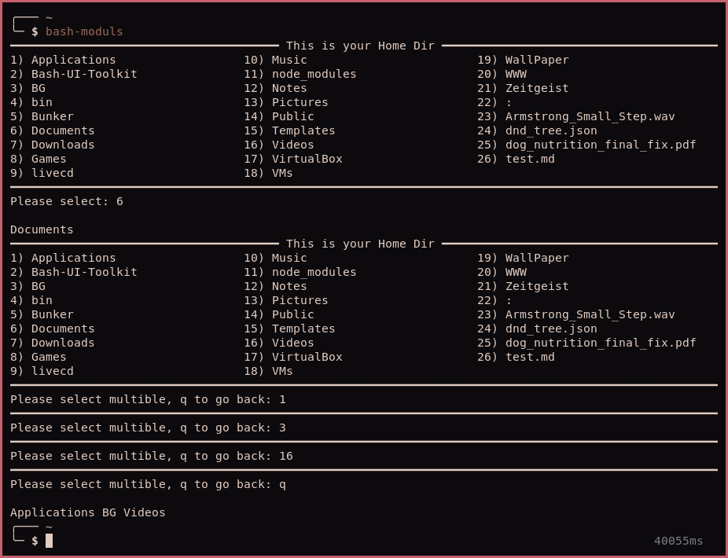

# Bash Moduls

Modules to make bash scripting UI easier. 

## Numbert selection list

- Syntax = `numlist <list> <promt> <title> <line-style>`
  
- Return Var = $RV
- List Divider = Space# 

### Example
```bash
LI=$(ls --group-directories-first ${HOME})
numlist "$LI" "Please select: " " This is your Home Dir "
```

## Multible selection

- Syntax = `multilist <list> <promt> <title> <line-style>`

- Return Var = $MV
- List Divider = Space

Let you enter multible choises and return a list of them.

### Example
```bash
LI=$(ls --group-directories-first ${HOME})
multilist "$LI" "Please select multible, q to go back: " " This is your Home Dir " "="
```

## Yes/No Box
  
`print_c " Are you sure? y/N " "━" ; read ; [[ $REPLY == [Yy] ]] && echo yes || echo no`

  
  ## Install
  
  Just copy to ${PATH} and make executible. 
  
  Then `source bash-moduls` in your script.
  
  
